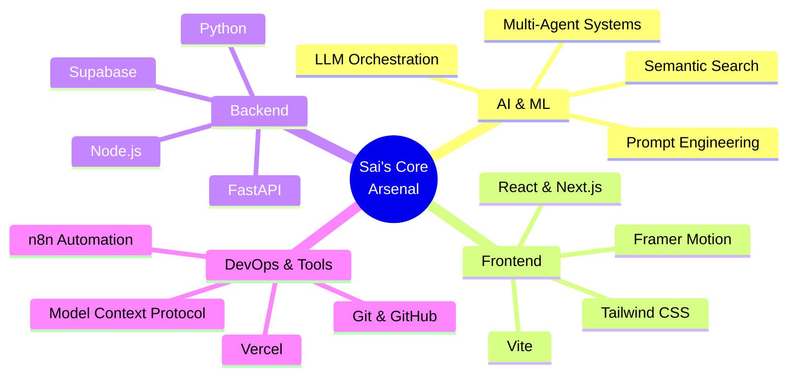
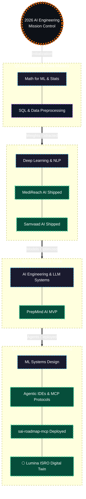

<p align="center">
  
</p>

<p align="center">
  
  <b>Hi, I'm Sai</b>
</p>

<h1 align="center">
  
</h1>

<p align="center">
  <a href="https://www.linkedin.com/in/sai-chintamani-a87b5b315">
    
  </a>
  
  
</p>

<p align="center">
  
  
  
</p>

<p align="center">
  
</p>

<table align="center">
<tr>
<td align="center" width="25%">
  <br/>
  <b>10+</b><br/><sub>Certifications</sub>
</td>
<td align="center" width="25%">
  <br/>
  <b>4</b><br/><sub>Live Builds</sub>
</td>
<td align="center" width="25%">
  <br/>
  <b>4</b><br/><sub>Agents Shipped</sub>
</td>
<td align="center" width="25%">
  <br/>
  <b>2026</b><br/><sub>Always Shipping</sub>
</td>
</tr>
</table>

---

## 👋 About Me

```yaml
name:        Sai Chintamani
role:        AI Engineering Student
focus:       Multi-Agent Systems · LLMs · EdTech
education:   B.Tech AI Engineering, GHRCE Nagpur (2nd Year)
based_in:    Nagpur, Maharashtra, India
currently:   Architecting Samvaad AI, MediReach AI, PrepMind AI & MCP Servers
linkedin:    linkedin.com/in/sai-chintamani-a87b5b315
```

- 🎓 2nd-year **B.Tech in AI Engineering** @ G.H. Raisoni College of Engineering, Nagpur
- 🌕 Built **[Lumina: ISRO Lunar Digital Twin](https://github.com/saichintamani/Lumina-)** — a 3D WebGL simulation of 64 autonomous rover swarms, explainable AI, NavCam ML vision, Earth-Moon latency, and spectroscopy at Faustini Crater — inspired by Chandrayaan-2
- 🗣️ Architected **Samvaad AI** — an advanced real-time conversational intelligence platform
- 🤖 Built **MediReach AI** — a multi-agent rural healthcare assistant for an "Agents for Good" track
- 🛠️ Building **PrepMind AI** — an EdTech SaaS for Indian engineering students' placement prep
- 🔍 Developed **sai-roadmap-mcp** — a deeply technical Model Context Protocol server featuring a from-scratch semantic search engine
- 📜 **10+ certifications** across Google Cloud, Microsoft Azure, Oracle, and IEEE-led programs — see the [Certifications Portal](#-certifications-portal) below
- 📚 Following a structured AI engineering roadmap — see [my 2026 roadmap](#-2026-roadmap--ai-engineering-pipeline)
- 🌍 Based in Nagpur — into solo travel & photography when not building

---

## 🧰 Tech Stack & Parameter Matrix



<p align="center">
  
</p>

<p align="center">
  
  
  
  
  
  <br/>
  
  
  
  
  
  <br/>
  
  
  
  
  <br/>
  
  
  
  
</p>

---

## 🌌 I Know My Portfolio

<div align="center">
  <a href="https://portfolio-delta-two-qf280bbhsg.vercel.app/" target="_blank">
    
  </a>
</div>

<p align="center">
  <a href="https://portfolio-delta-two-qf280bbhsg.vercel.app/" target="_blank">
    
  </a>
</p>

---

<div align="center">
  
</div>

## 📌 Projects Portal

<table align="center" width="100%">
<tr>
<td width="50%" valign="top">

### 🌕 [Lumina — ISRO Lunar Digital Twin](https://github.com/saichintamani/Lumina-)
A production-ready **3D WebGL mission intelligence platform** for ISRO's lunar South Pole exploration at Faustini Crater, powered by Chandrayaan-2 radar data.

🤖 `64 Boids Rovers` · 🧠 `Explainable AI` · ⏱️ `Earth-Moon Latency` · 📸 `NavCam ML HUD`

Runs 64 autonomous micro-rovers via the Boids algorithm at 60 FPS in WebGL, with a 9-stage guided Demo Mode, volumetric spectroscopy, and a solar flare scenario engine — all in the browser.

[](https://antigravity-faxkdjo57-sai-chintamanis-projects.vercel.app/)

</td>
<td width="50%" valign="top">

### 🔍 [sai-roadmap-mcp](https://github.com/saichintamani/sai-roadmap-mcp)
A deeply technical Model Context Protocol (MCP) server featuring a **from-scratch semantic search engine**—no external embeddings.

🐍 `Python/NumPy` · 📊 `TF-IDF + SVD` · 🔌 `MCP Protocol`

Implements Latent Semantic Analysis (LSA), PMI bigram detection, and precise evaluation metrics directly integrated with Claude Desktop.

</td>
</tr>
<tr>
<td width="50%" valign="top">

### 🏥 [MediReach AI](https://github.com/saichintamani/medireach)
A high-tech, multi-agent rural healthcare assistant built for the **"Agents for Good"** track, featuring a stunning cybernetic UI.

🤖 `4 Agents` · 🖥️ `React/Next.js` · 🧠 `Gemini Pro`

Orchestrates Locator, First-Aid, Medicine, and Scheme agents in perfect coordination via an interactive 3D digital twin interface.

</td>
<td width="50%" valign="top">

### 📖 [PrepMind AI](https://github.com/saichintamani/PrepMind-Ai)
An elite EdTech SaaS platform designed to supercharge Indian engineering students' placement preparation.

🖥️ `React/Vite` · 🎯 `DSA IDE` · 🧠 `GPT-4o`

Features secure authentication, Razorpay integrations, PDF-to-Quiz generative AI pipelines, and a premium `#FF6B00` brand aesthetic.

</td>
</tr>
<tr>
<td width="50%" valign="top">

### 🗣️ [Samvaad AI](https://github.com/saichintamani/SamvaadAI)
An advanced conversational intelligence platform providing seamless multi-lingual voice and text interactions.

🤖 `Real-time AI` · 🎙️ `Speech-to-Text` · 🧠 `LLM Orchestration`

Engineered a robust frontend with dynamic voice visualization and highly responsive chat interfaces for an immersive user experience.

</td>
<td width="50%" valign="top">

### 🍪 [OREO Landing Page](https://github.com/saichintamani/OREO-Landing-Page)
A premium, highly animated single-page brand site celebrating the classic "twist, lick, dunk" experience.

🎨 `Vanilla JS` · ✨ `Scroll Reveal` · 🖱️ `Custom Cursor`

Features a fluid 12-flavor product catalog with live filtering, continuous marquee animations, and an interactive cart UI.

</td>
</tr>
</table>

📄 [Browse all project repositories →](https://github.com/saichintamani?tab=repositories)

---

## 🚀 Live Deployments & Demonstrations

| Project | Live URL | Description |
|---|---|---|
| 🌕 **Lumina — ISRO Lunar Twin** | 🌐 [antigravity-faxkdjo57-sai-chintamanis-projects.vercel.app](https://antigravity-faxkdjo57-sai-chintamanis-projects.vercel.app/) | Explore the 3D lunar simulation — NavCam, Boids Swarm, AI Orchestrator & Earth-Moon Latency. |
| **MediReach AI** | 🌐 [Live Demo Link in Repo](https://github.com/saichintamani/medireach) | Interact with the rural healthcare multi-agent system. |
| **PrepMind AI** | 🌐 [prep-mind-ai-chi.vercel.app](https://prep-mind-ai-chi.vercel.app/) | Explore the EdTech placement prep SaaS and PDF-to-Quiz generators. |
| **Samvaad AI** | 🌐 [samvaadai.vercel.app](https://samvaadai.vercel.app/) | Test the real-time multilingual voice intelligence platform. |
| **OREO Website** | 🌐 [Live Demo Link in Repo](https://github.com/saichintamani/OREO-Landing-Page) | View the high-fidelity scroll animations and flavor catalog. |

---

## 🎓 Certifications Portal

<table align="center" width="100%">
<tr><td>

<div align="center">

### 📜 Credentials Dashboard

</div>

| ☁️ Cloud & AI Platforms | 🤖 Generative AI | 🏆 Competitions & Workshops |
|---|---|---|
| Google Cloud — *Intro to AI & ML* (Jun 2025) | Microsoft Azure — *GenAI for Business w/ OpenAI* (May 2024) | IEEE Computer Society — *Cygnus 2025 Hackathon* (Nov 2025) |
| Microsoft India — *Intro to AI & ML* (May 2024) | Google × Kaggle — *5-Day AI Agents: Vibe Coding* (2026) | IEEE CIS — *Talk To Code: MCP Agentverse* (Aug 2025) |
| Oracle — *Cloud Infra AI Foundations Associate* (Oct 2025) ✅ | | |

| 🐍 Python & Data | 
|---|
| IIT Bombay (Spoken Tutorial) — *Python 3.4.3 Training* — Score: **90.1%** (Nov 2025) |
| IIT Bombay (Spoken Tutorial) — *Python for Machine Learning* — Score: **94.0%** (Jun 2026) |
| Intellipaat — *SQL Course Certification* — Credential ID `31679-913167-374099` ✅ |

<div align="center">

**10+ Certifications** &nbsp;·&nbsp; **3 with verified credential links** &nbsp;·&nbsp; **4 issuing platforms**

📄 [Full breakdown with skills tagged →](docs/certifications.md)

</div>

</td></tr>
</table>

---

## 🗺️ 2026 Roadmap & AI Engineering Pipeline



<div align="center">
  
</div>

📄 Full breakdown in [docs/roadmap.md](docs/roadmap.md)

---

## 🏆 Trophies & Milestones

<p align="center">
  
</p>

---

## 📊 GitHub Stats

<p align="center">
  
  
</p>

<p align="center">
  
</p>

<p align="center">
  
</p>

---

## 🐍 Contribution Snake

<p align="center">
  <picture>
    <source media="(prefers-color-scheme: dark)" srcset="https://raw.githubusercontent.com/saichintamani/saichintamani/output/github-contribution-grid-snake-dark.svg">
    <source media="(prefers-color-scheme: light)" srcset="https://raw.githubusercontent.com/saichintamani/saichintamani/output/github-contribution-grid-snake.svg">
    
  </picture>
</p>

> Auto-updates daily via [.github/workflows/snake.yml](.github/workflows/snake.yml)

---

## 📫 Connect

<p align="center">
  <a href="https://www.linkedin.com/in/sai-chintamani-a87b5b315">
    
  </a>
</p>

---

<p align="center">
  <i>🔭 Currently exploring multi-agent orchestration & EdTech for engineering students in India</i>
</p>


