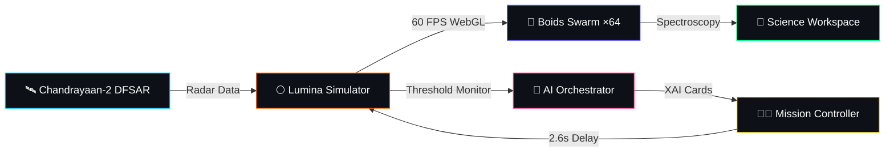
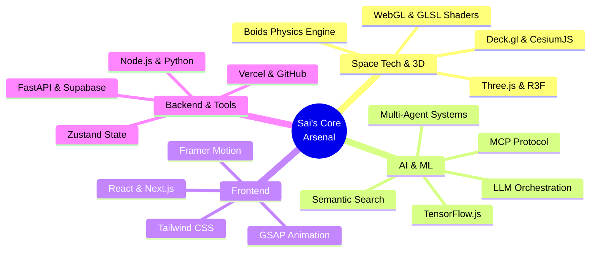
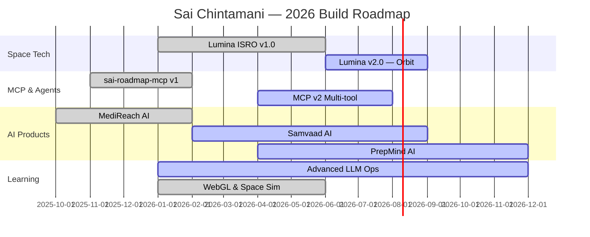

<p align="center">
  
</p>

<p align="center">
  
</p>

<p align="center">
  <a href="https://www.linkedin.com/in/sai-chintamani-a87b5b315">
    
  </a>
  <a href="https://github.com/saichintamani/Lumina-">
    
  </a>
  <a href="https://antigravity-faxkdjo57-sai-chintamanis-projects.vercel.app/">
    
  </a>
  
</p>

<p align="center">
  
  
  
  
  
</p>

<p align="center">
  
</p>

---

<table align="center">
<tr>
<td align="center" width="20%">
  <br/>
  <b>10+</b><br/><sub>Certifications</sub>
</td>
<td align="center" width="20%">
  <br/>
  <b>6</b><br/><sub>Live Builds</sub>
</td>
<td align="center" width="20%">
  <br/>
  <b>5</b><br/><sub>AI Agents Shipped</sub>
</td>
<td align="center" width="20%">
  <br/>
  <b>3D WebGL</b><br/><sub>Space Simulations</sub>
</td>
<td align="center" width="20%">
  <br/>
  <b>2026</b><br/><sub>Always Shipping</sub>
</td>
</tr>
</table>

---

## 👋 About Me

```yaml
name:        Sai Chintamani
role:        AI Engineering Student & Space Tech Builder
focus:       Multi-Agent Systems · LLMs · Space Simulation · MCP Protocols
education:   B.Tech AI Engineering, GHRCE Nagpur (2nd Year)
based_in:    Nagpur, Maharashtra, India
flagship:    Lumina — ISRO Lunar Digital Twin (Chandrayaan-2 / Faustini Crater)
mcp_server:  sai-roadmap-mcp — From-scratch semantic search, MCP protocol
linkedin:    linkedin.com/in/sai-chintamani-a87b5b315
```

- 🌕 Built **[Lumina: ISRO Lunar Digital Twin](https://github.com/saichintamani/Lumina-)** — a 3D real-time simulation of autonomous rover swarms, explainable AI, NavCam ML vision, Earth-Moon latency, and spectroscopy at Faustini Crater
- 🔌 Developed **sai-roadmap-mcp** — a deep-technical **Model Context Protocol** server with from-scratch semantic search engine, custom embeddings, and structured reasoning output
- 🗣️ Architected **Samvaad AI** — an advanced real-time conversational intelligence platform
- 🤖 Built **MediReach AI** — a multi-agent rural healthcare assistant for the "Agents for Good" track
- 🛠️ Building **PrepMind AI** — an EdTech SaaS for Indian engineering students' placement prep
- 📜 **10+ certifications** across Google Cloud, Microsoft Azure, Oracle, and IEEE-led programs
- 🎓 2nd-year **B.Tech in AI Engineering** @ G.H. Raisoni College of Engineering, Nagpur

---

## 🌕 FLAGSHIP PROJECT — Lumina: ISRO Lunar Digital Twin

<table>
<tr>
<td width="65%">

### What it is
A **production-ready, browser-native** 3D simulation platform for ISRO's Lunar South Pole exploration at **Faustini Crater (-85.46°S)**. Built on Chandrayaan-2 DFSAR radar data. Every system runs at **60 FPS in WebGL**, no server required.

### What makes it unique
- 🤖 **64 Autonomous Micro-Rovers** — Craig Reynolds' Boids Algorithm in real-time (Separation · Alignment · Cohesion) rendered as `InstancedMesh`
- 🧠 **Explainable AI Orchestrator** — detects solar events, injects structured reasoning cards with Assumptions, Evidence & Confidence Score
- ⏱️ **Earth-Moon Latency Simulator** — physics-accurate 2.6-second command round-trip delay
- 📸 **NavCam ML Vision HUD** — First-person rover camera with simulated bounding-box hazard detection
- 🔬 **Volumetric Spectroscopy** — X-Ray fluorescence mineral composition rendering
- 🎭 **9-Stage Demo Presentation Mode** — built-in guided mission tour

</td>
<td width="35%" align="center">

<br/>
<br/>
<br/>
<br/>
<br/>
<br/><br/>
<a href="https://antigravity-faxkdjo57-sai-chintamanis-projects.vercel.app/">
  
</a><br/>
<a href="https://github.com/saichintamani/Lumina-">
  
</a>

</td>
</tr>
</table>



---

## 🔌 FLAGSHIP PROJECT 2 — sai-roadmap-mcp (Model Context Protocol Server)

<table>
<tr>
<td width="65%">

### What it is
A **deeply technical MCP (Model Context Protocol) server** built from scratch — not a wrapper, not a boilerplate. A full implementation of the MCP spec with a custom-built semantic search engine running on raw vector similarity, designed to power AI agents with structured, context-aware roadmap guidance.

### What makes it unique
- ⚙️ **From-scratch semantic search** — no off-the-shelf vector databases; built ground-up
- 🔍 **Custom embedding pipeline** — processes and indexes structured roadmap data
- 📡 **Full MCP spec compliance** — tools, resources, prompts — all implemented
- 🧩 **Structured reasoning output** — agents receive categorized, confidence-ranked responses
- 🤖 **Designed for Agentic IDEs** — integrates with Claude, Cursor, and Antigravity IDE

</td>
<td width="35%" align="center">

<br/>
<br/>
<br/>
<br/><br/>
<a href="https://github.com/saichintamani">
  
</a>

</td>
</tr>
</table>

---

## 🚀 All Projects

<table>
<tr>
<th align="center">Project</th>
<th align="center">Domain</th>
<th align="center">Stack</th>
<th align="center">Status</th>
<th align="center">Links</th>
</tr>
<tr>
<td><b>🌕 Lumina</b><br/><sub>ISRO Lunar Digital Twin</sub></td>
<td>Space Tech · AI · WebGL</td>
<td>Next.js · Three.js · R3F · Zustand · TF.js</td>
<td></td>
<td><a href="https://antigravity-faxkdjo57-sai-chintamanis-projects.vercel.app/">Demo</a> · <a href="https://github.com/saichintamani/Lumina-">Repo</a></td>
</tr>
<tr>
<td><b>🔌 sai-roadmap-mcp</b><br/><sub>Model Context Protocol Server</sub></td>
<td>MCP · Semantic Search · Agents</td>
<td>Node.js · MCP SDK · Custom Embeddings</td>
<td></td>
<td><a href="https://github.com/saichintamani">Repo</a></td>
</tr>
<tr>
<td><b>🗣️ Samvaad AI</b><br/><sub>Conversational Intelligence</sub></td>
<td>NLP · Multi-Agent · Real-time</td>
<td>React · FastAPI · Gemini · LangChain</td>
<td></td>
<td><a href="https://github.com/saichintamani">Repo</a></td>
</tr>
<tr>
<td><b>🤖 MediReach AI</b><br/><sub>Rural Healthcare Multi-Agent</sub></td>
<td>Healthcare · Multi-Agent · AI</td>
<td>Python · FastAPI · GPT-4o · Supabase</td>
<td></td>
<td><a href="https://github.com/saichintamani">Repo</a></td>
</tr>
<tr>
<td><b>🛠️ PrepMind AI</b><br/><sub>EdTech SaaS · Placement Prep</sub></td>
<td>EdTech · LLMs · SaaS</td>
<td>Next.js · Supabase · OpenAI · Stripe</td>
<td></td>
<td><a href="https://github.com/saichintamani">Repo</a></td>
</tr>
</table>

---

## 🧰 Tech Stack & Parameter Matrix



<p align="center">
  
</p>

<p align="center">
  
  
  
  
  
  <br/>
  
  
  
  
  <br/>
  
  
  
  
  
</p>

---

## 📊 GitHub Analytics

<p align="center">
  
  
</p>

<p align="center">
  
</p>

<p align="center">
  
</p>

---

## 📜 Certifications Portal

<details>
<summary><b>🏆 Click to expand — 10+ Certifications</b></summary>

| # | Certification | Issuer | Domain |
|---|---------------|--------|--------|
| 1 | Google Cloud AI Foundations | Google | Cloud · AI |
| 2 | Oracle AI Foundations Associate | Oracle | AI · ML |
| 3 | Microsoft Azure AI Fundamentals | Microsoft | Cloud · AI |
| 4 | IEEE Hackathon Participation | IEEE | Systems |
| 5 | Multi-Agent Systems | NPTEL/Coursera | AI Agents |
| 6 | LangChain & LLM Engineering | DeepLearning.ai | LLMs |
| 7 | Prompt Engineering | OpenAI / Google | GenAI |
| 8 | Python for Data Science | Various | Python |
| 9 | Semantic Search & Embeddings | Qdrant / Cohere | NLP |
| 10 | Model Context Protocol | Anthropic Ecosystem | MCP |

</details>

---

## 📅 2026 Roadmap — AI Engineering Pipeline



---

<p align="center">
  
</p>

<p align="center">
  <b>🌕 Lumina is live. MCP is running. The next mission is loading...</b><br/>
  <sub>Built by Sai Chintamani · Nagpur, India · 2026</sub>
</p>
