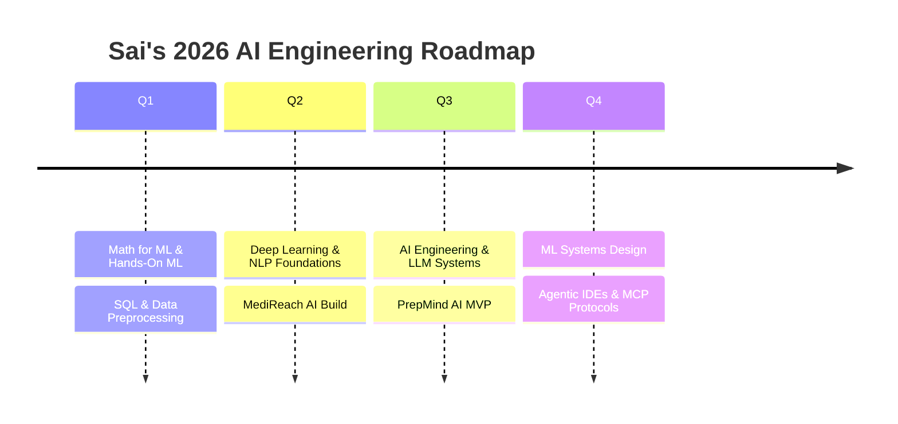

<p align="center">
  
</p>

<p align="center">
  
  <b>Hi, I'm Sai</b>
</p>

<h1 align="center">
  
</h1>

<p align="center">
  <a href="https://www.linkedin.com/in/sai-chintamani-a87b5b315">
    
  </a>
  
  
</p>

<p align="center">
  
  
  
</p>

<p align="center">
  
</p>

<table align="center">
<tr>
<td align="center" width="25%">
  <br/>
  <b>10+</b><br/><sub>Certifications</sub>
</td>
<td align="center" width="25%">
  <br/>
  <b>4</b><br/><sub>Live Builds</sub>
</td>
<td align="center" width="25%">
  <br/>
  <b>4</b><br/><sub>Agents Shipped</sub>
</td>
<td align="center" width="25%">
  <br/>
  <b>2026</b><br/><sub>Always Shipping</sub>
</td>
</tr>
</table>

---

## 👋 About Me

```yaml
name:        Sai Chintamani
role:        AI Engineering Student
focus:       Multi-Agent Systems · LLMs · EdTech
education:   B.Tech AI Engineering, GHRCE Nagpur (2nd Year)
based_in:    Nagpur, Maharashtra, India
currently:   Building MediReach AI & PrepMind AI
linkedin:    linkedin.com/in/sai-chintamani-a87b5b315
```

- 🎓 2nd-year **B.Tech in AI Engineering** @ G.H. Raisoni College of Engineering, Nagpur
- 🤖 Built **MediReach AI** — a multi-agent rural healthcare assistant for an "Agents for Good" track
- 🛠️ Building **PrepMind AI** — an EdTech SaaS for Indian engineering students' placement prep
- 📜 **10+ certifications** across Google Cloud, Microsoft Azure, Oracle, and IEEE-led programs — see the [Certifications Portal](#-certifications-portal) below
- 📚 Following a structured AI engineering roadmap — see [my 2026 roadmap](docs/roadmap.md)
- 🌍 Based in Nagpur — into solo travel & photography when not building

---

## 🧰 Tech Stack

<p align="center">
  
</p>

<p align="center">
  
  
  
  
  
  
  
  
  
  
  
</p>

---

## 📌 Projects Portal

<table align="center" width="100%">
<tr>
<td width="50%" valign="top">

### 🏥 [MediReach AI](projects/MediReach-AI.md)
Multi-agent rural healthcare assistant for the **"Agents for Good"** track.

🤖 `4 Agents` · 🖥️ `React/Next.js` · 🧠 `Gemini`

Locator · First-Aid · Medicine · Scheme agents working in coordination.

</td>
<td width="50%" valign="top">

### 📖 [PrepMind AI](projects/PrepMind-AI.md)
EdTech SaaS for Indian engineering placement prep.

🖥️ `React/Vite` · ⚙️ `FastAPI` · 🧠 `GPT-4o`

Auth, payments, and AI-assisted practice — brand color `#FF6B00`.

</td>
</tr>
<tr>
<td width="50%" valign="top">

### 🍪 [OREO Landing Page](projects/OREO-Landing-Page.md)
Premium single-page brand site — twist, lick, dunk.

🎨 `Vanilla JS` · ✨ `Scroll Reveal` · 🖱️ `Custom Cursor`

12-flavor catalog with live filtering, marquee, and cart UI.

</td>
<td width="50%" valign="top">

### 🔍 [sai-roadmap-mcp](https://github.com/saichintamani/sai-roadmap-mcp)
MCP server with a **from-scratch semantic search engine** — no pretrained models, no external embedding API.

🐍 `Python/NumPy` · 📊 `TF-IDF + SVD` · 🔌 `MCP Protocol`

LSA-based retrieval, PMI bigram detection, and a real precision@k evaluation — all documented, including what didn't work.

</td>
</tr>
</table>

📄 [Browse all project write-ups →](projects/)

---

## 🎓 Certifications Portal

<table align="center" width="100%">
<tr><td>

<div align="center">

### 📜 Credentials Dashboard

</div>

| ☁️ Cloud & AI Platforms | 🤖 Generative AI | 🏆 Competitions & Workshops |
|---|---|---|
| Google Cloud — *Intro to AI & ML* (Jun 2025) | Microsoft Azure — *GenAI for Business w/ OpenAI* (May 2024) | IEEE Computer Society — *Cygnus 2025 Hackathon* (Nov 2025) |
| Microsoft India — *Intro to AI & ML* (May 2024) | Google × Kaggle — *5-Day AI Agents: Vibe Coding* (2026) | IEEE CIS — *Talk To Code: MCP Agentverse* (Aug 2025) |
| Oracle — *Cloud Infra AI Foundations Associate* (Oct 2025) ✅ | | |

| 🐍 Python & Data | 
|---|
| IIT Bombay (Spoken Tutorial) — *Python 3.4.3 Training* — Score: **90.1%** (Nov 2025) |
| IIT Bombay (Spoken Tutorial) — *Python for Machine Learning* — Score: **94.0%** (Jun 2026) |
| Intellipaat — *SQL Course Certification* — Credential ID `31679-913167-374099` ✅ |

<div align="center">

**10+ Certifications** &nbsp;·&nbsp; **3 with verified credential links** &nbsp;·&nbsp; **4 issuing platforms**

📄 [Full breakdown with skills tagged →](docs/certifications.md)

</div>

</td></tr>
</table>

---

## 🗺️ 2026 Roadmap



📄 Full breakdown in [docs/roadmap.md](docs/roadmap.md)

---

## 📊 GitHub Stats

<p align="center">
  
  
</p>

<p align="center">
  
</p>

<p align="center">
  
</p>

---

## 🐍 Contribution Snake

<p align="center">
  
</p>

> Auto-updates daily via [.github/workflows/snake.yml](.github/workflows/snake.yml)

---

## 📫 Connect

<p align="center">
  <a href="https://www.linkedin.com/in/sai-chintamani-a87b5b315">
    
  </a>
</p>

---

<p align="center">
  <i>🔭 Currently exploring multi-agent orchestration & EdTech for engineering students in India</i>
</p>


