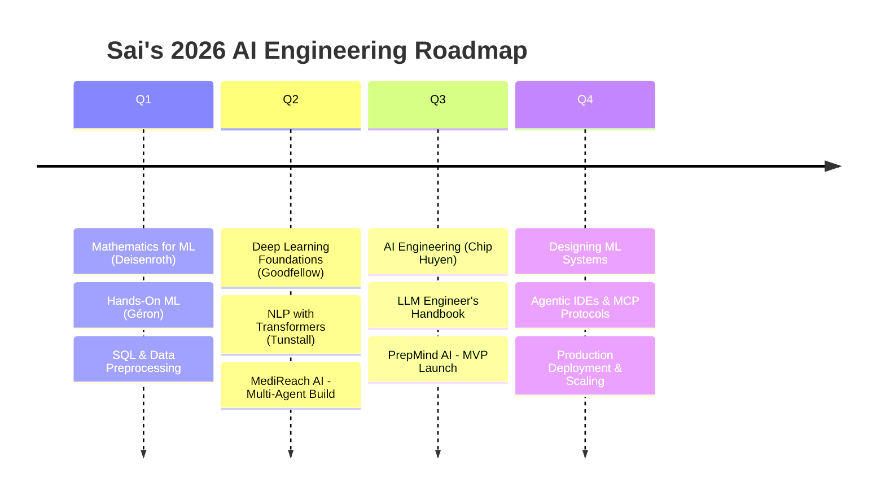

# 2026 Learning & Build Roadmap

My focus areas across 2026 — based on the AI engineering self-study sequence I'm following alongside coursework at GHRCE.

## Why this order

The sequence follows a deliberate path: math and classical ML first (Deisenroth, Géron), then deep learning and NLP foundations (Goodfellow, Tunstall), then applied AI engineering and LLM systems (Huyen, LLM Engineer's Handbook), and finally systems design for production ML. Each quarter pairs theory with a real build — MediReach AI and PrepMind AI are where the concepts get tested.

## Currently building

- **MediReach AI** — multi-agent rural healthcare assistant (Locator, First-Aid, Medicine, Scheme agents)
- **PrepMind AI** — EdTech SaaS for Indian engineering placement prep
